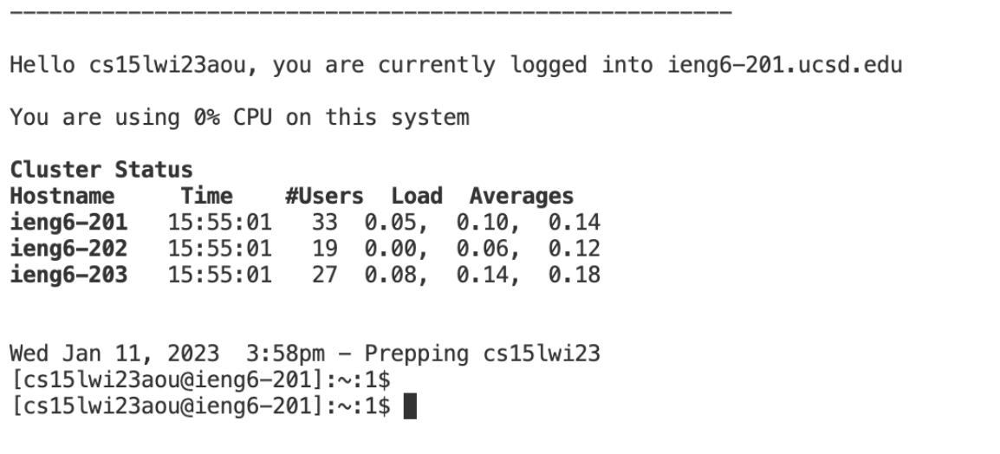
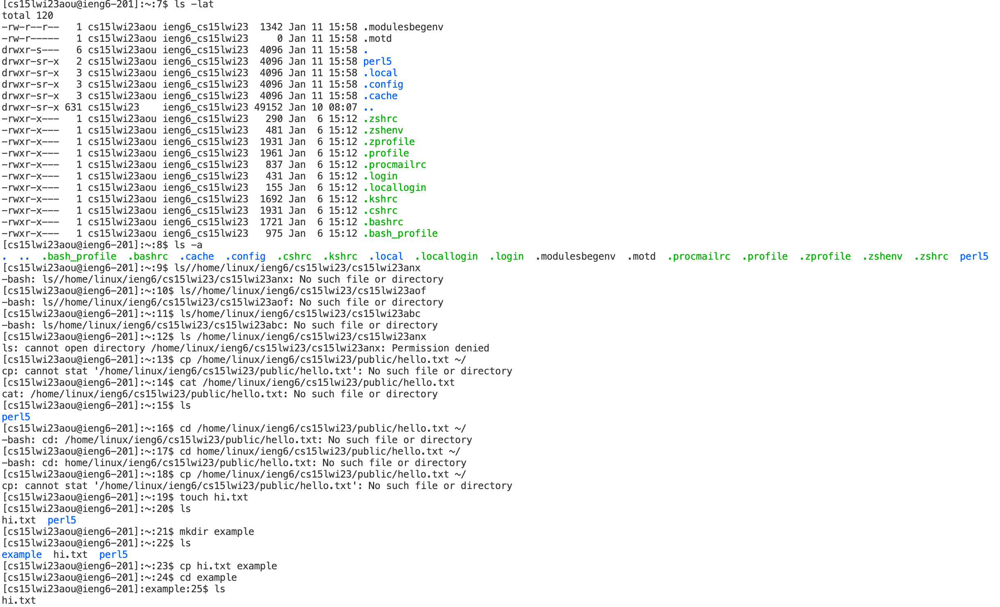

Week 1 Lab: Markdown, URLs, Paths, and the Filesystem
 **Installing VScode**
  1. Download VSCode from official website.
  2. Follow the instructions on the website page.
  3. Open VScode. It should look like the window below:

 
 **Remotely Connecting**
  1. Open a new terminal in VScode

 
  2. Enter *ssh cs15lwi23zz@ieng6.ucsd.edu* to the command line, with *zz* replaced with your own CSE account name.

 
  3. Now enter the correct password to the place that indicates *password\:*
  4. After entering the correnct password, you will see something similar to what's in below:

  This indicates that your terminal is connected to a computer in the CSE basement! Now you can try to enter some commands to test the output.
 
 **Trying Some Commands**
  Try to enter some terminal line commands that we learned in class.
  Some Examples of commands and outputs can be:

  Feel free to enter more commands that you want to test!
 
 
