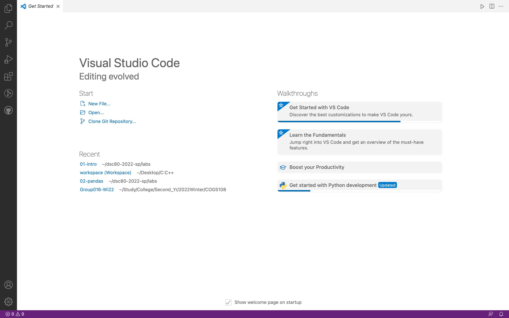
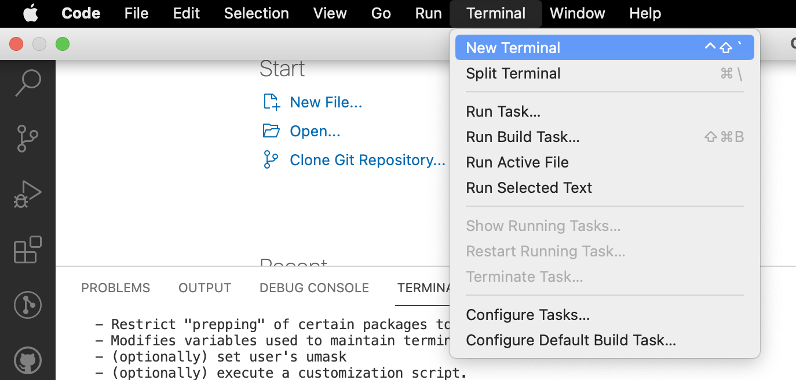

Week 1 Lab: Markdown, URLs, Paths, and the Filesystem
 **Installing VScode**
  1. Download VSCode from official website.
  2. Follow the instructions on the website page
  3. Open VScode. It should look like the window below
 

 
 **Remotely Connecting**
  1. Open a new terminal in VScode
 

 
 
 
 
 **Trying Some Commands**
 
 
 
 
